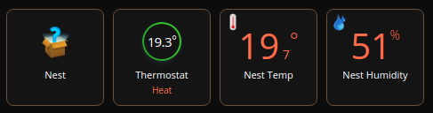
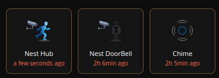

# Fibaro
Some Fibaro QuickApp.

## Google Nest Devices

Support for the following types of Nest Devices:
* Nest Thermostat
* Nest Camera (motion detection)
* Nest Doorbell (chime)

Full documentation on [this page](quickApp/Nest/README.md).

## Unifi Cameras

Support for the following types of devices:
* Unifi Cameras connected to a Unifi Protect controller.

Full documentation on [this page](quickApp/unifiProtect/README.md).

## Unifi Presence

Use a smartphone MAC address to compute the presence/absence of the home.
* Unifi Network Controller is required.

Full documentation on [this page](quickApp/unifiPresence/README.md).

## OpenWeather

Get the weather from [OpenWeatherMap](https://openweathermap.org).

Full documentation on [this page](quickApp/OpenWeather/README.md).

