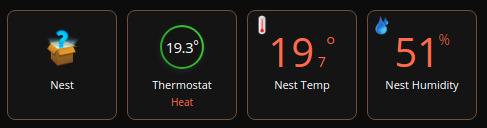

# QuickApp for Nest devices

QuickApp used to control Nest Thermostat on Fibaro HC3

Device type: *device controller*

## Supported device type

* Nest Thermostat

*Account permissions requirement*: access and control your thermostat

*Features*: change the heating point, change mode, get state, get ambiant temperature and humidity

*Supported mode*: Off, Heat, Manual Eco

## Requirement

Create an Google Device Nest Account in [https://developers.google.com/nest/device-access](https://developers.google.com/nest/device-access)

Follow the QuickStart in [https://developers.google.com/nest/device-access/get-started](https://developers.google.com/nest/device-access/get-started)

Link your account in [https://developers.google.com/nest/device-access/authorize](https://developers.google.com/nest/device-access/authorize)

## Detailled Installation Guide

All steps are explained in the quickstart [https://developers.google.com/nest/device-access/get-started](https://developers.google.com/nest/device-access/get-started)

These steps are:
1. Create a Google Device Nest Account in [https://developers.google.com/nest/device-access](https://developers.google.com/nest/device-access)
2. Create a "Google Cloud Project" in [https://developers.google.com/nest/device-access/get-started#set_up_google_cloud_platform](https://developers.google.com/nest/device-access/get-started#set_up_google_cloud_platform)
    - Select Web Server when it asks "Where are you calling from?"
    - Enter https://www.google.com as the value for Authorized redirect URIs.
    - Keep the **_"OAuth 2.0 Client ID"_** and **_"Client Secret"_** values (they are also written in the file credentials.json)
3. Create a new project in [https://console.nest.google.com/device-access/project-list](https://console.nest.google.com/device-access/project-list)
    - Set a project's name
    - Set the **_"OAuth 2.0 Client ID"_** retrieved during the step 2
    - It is not required to enable the Google cloud Pub/Sub
    - At the end, you obtain a **_"Project ID"_** of the form "32c4c2bc-fe0d-461b-b51c-f3885afff2f0"
4. To finish, you can import the quickApp in Fibaro Home Center 3 and set the Variables (see the table below)

## Variables

| Name          | Description   | Example of value |
| ------------- | ------------- |------------------|
| projectId    |  **_"Project ID"_** created in [https://console.nest.google.com/device-access/project-list](https://console.nest.google.com/device-access/project-list) (step 3 of the detailled installation guide)    |  32c4c2bc-fe0d-461b-b51c-f3885afff2f0 |
| clientId  | **_"OAuth 2.0 Client ID"_** created in [https://console.developers.google.com/apis/credentials](https://console.developers.google.com/apis/credentials) (step 2 of the detailled installation guide)  | |
| clientSecret  |  **_"Client Secret"_** created in [https://console.developers.google.com/apis/credentials](https://console.developers.google.com/apis/credentials) (step 2 of the detailled installation guide)  | |
| code  | **_"Authentication code"_**. Set xxx for the fisrt time and see below  | 4/xxxxx-xxxxxxxxxxxxxxxxxxxxxxxxxxxxxxxxxxxxx |
| frequency  | delay in second to refresh the value  | 60 |
| refreshToken  | OAuth2 refresh token  | Automatically retrieve. Set it to ‘-’ for the fisrt time |

## Get the Authentication code

Once the quickApp is started, after few minutes, you will receive a mail, notification and error log containing a URL.
This URL is used to configure authorization. Do:
- Allow to get information about your home (at step 1)
- Allow access and control to your Nest Thermostat
- At the end, you will be redirected to an URL of the form https://www.google.com/?code=4/xxxxx-xxxxxxxxxxxxxxxxxxxxxxxxxxxxxxxxxxxxx&scope=https://www.googleapis.com/auth/sdm.service
    - The part 4/xxxxx-xxxxxxxxxxxxxxxxxxxxxxxxxxxxxxxxxxxxx is the **_"Authentication code"_**
    - Set this code inside the corresponding quickApp variable named 'code'.

