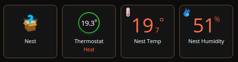
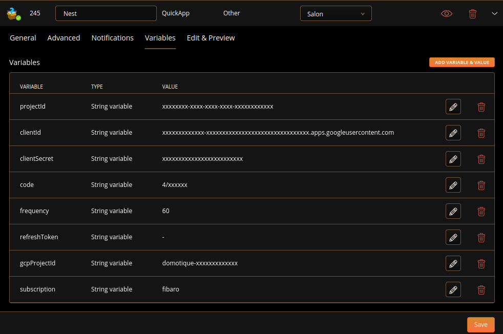
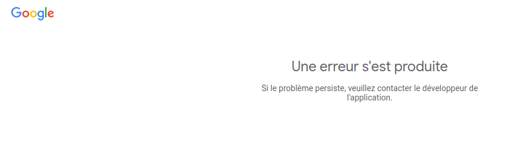
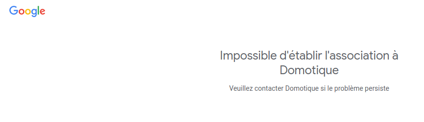
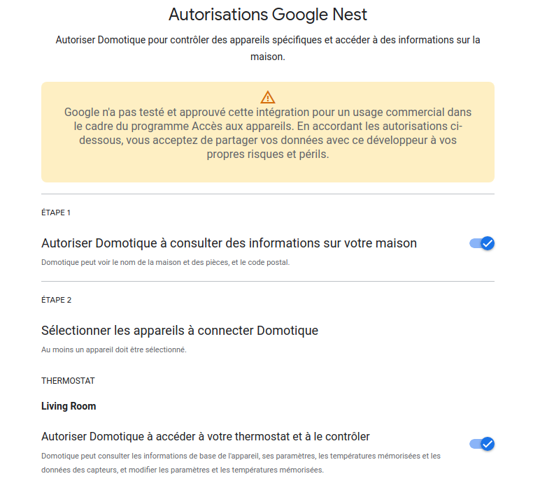
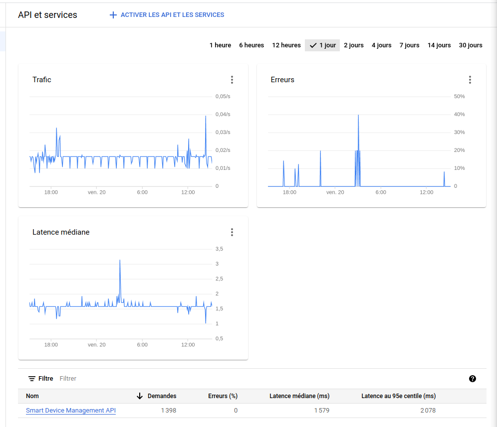

# QuickApp for Nest devices with Google account

QuickApp used to control Nest Thermostat on Fibaro HC3

Device type: *device controller*

## Supported device type

* Nest Thermostat

*Account permissions requirement*: access and control your thermostat

*Features*: change the heating point, change mode, get mode, get state, get ambiant temperature and humidity

*Supported mode*: Off, Heat, Manual Eco, Cooling (if Thermostat support it)




## Requirement

Create an Google Device Nest Account in [https://developers.google.com/nest/device-access](https://developers.google.com/nest/device-access)

Follow the QuickStart in [https://developers.google.com/nest/device-access/get-started](https://developers.google.com/nest/device-access/get-started)

Link your account in [https://developers.google.com/nest/device-access/authorize](https://developers.google.com/nest/device-access/authorize)

## Detailled Installation Guide

All steps are explained in the quickstart [https://developers.google.com/nest/device-access/get-started](https://developers.google.com/nest/device-access/get-started)

These steps are:
1. Create a Google Device Nest Account in [https://developers.google.com/nest/device-access](https://developers.google.com/nest/device-access)
2. Create a "Google Cloud Project" in [https://developers.google.com/nest/device-access/get-started#set_up_google_cloud_platform](https://developers.google.com/nest/device-access/get-started#set_up_google_cloud_platform)
    - Select Web Server when it asks "Where are you calling from?"
    - Enter https://www.google.com as the value for Authorized redirect URIs.
    - Keep the **_"OAuth 2.0 Client ID"_** and **_"Client Secret"_** values (they are also written in the file credentials.json)
3. Create a new project in [https://console.nest.google.com/device-access/project-list](https://console.nest.google.com/device-access/project-list)
    - Set a project's name
    - Set the **_"OAuth 2.0 Client ID"_** retrieved during the step 2
    - It is not required to enable the Google cloud Pub/Sub
    - At the end, you obtain a **_"Project ID"_** of the form "32c4c2bc-fe0d-461b-b51c-f3885afff2f0"
4. To finish, you can import the quickApp in Fibaro Home Center 3 and set the Variables (see the table below)

## Variables

| Name          | Description   | Example of value |
| ------------- | ------------- |------------------|
| projectId    |  **_"Project ID"_** created in [https://console.nest.google.com/device-access/project-list](https://console.nest.google.com/device-access/project-list) (step 3 of the detailled installation guide)    |  32c4c2bc-fe0d-461b-b51c-f3885afff2f0 |
| clientId  | **_"OAuth 2.0 Client ID"_** created in [https://console.developers.google.com/apis/credentials](https://console.developers.google.com/apis/credentials) (step 2 of the detailled installation guide)  | |
| clientSecret  |  **_"Client Secret"_** created in [https://console.developers.google.com/apis/credentials](https://console.developers.google.com/apis/credentials) (step 2 of the detailled installation guide)  | |
| code  | **_"Authentication code"_**. Set xxx for the fisrt time and see below  | 4/xxxxx-xxxxxxxxxxxxxxxxxxxxxxxxxxxxxxxxxxxxx |
| frequency  | delay in second to refresh the value  | 60 |
| refreshToken  | OAuth2 refresh token  | Automatically retrieve. Set it to ‘-’ for the fisrt time |



## Get the Authentication code

Once the quickApp is started, after few minutes, you will receive a mail, notification and error log containing a URL.
This URL is used to configure authorization. Do:
- Allow to get information about your home (at step 1)
- Allow access and control to your Nest Thermostat
- At the end, you will be redirected to an URL of the form https://www.google.com/?code=4/xxxxx-xxxxxxxxxxxxxxxxxxxxxxxxxxxxxxxxxxxxx&scope=https://www.googleapis.com/auth/sdm.service
    - The part 4/xxxxx-xxxxxxxxxxxxxxxxxxxxxxxxxxxxxxxxxxxxx is the **_"Authentication code"_**
    - Set this code inside the corresponding quickApp variable named 'code'.


## Troubleshooting

### Authentication - projectId problem

In the console log, you have this kind of log (you have to wait 2*frequency because each authentication step is made one loop).

```bash
[23.01.2023] [14:06:26] [ERROR] [QUICKAPP245]: getAccessToken() status is 400: { "error
[23.01.2023] [14:07:26] [DEBUG] [QUICKAPP245]: Get Google refresh token
[23.01.2023] [14:07:26] [ERROR] [QUICKAPP245]: getRefreshToken() status is 400: { "error
[23.01.2023] [14:08:26] [ERROR] [QUICKAPP245]: Need to refresh Nest Authentication code for quickApp 245 with https://nestservices.google.com/partnerconnections/xxx/auth?redirect_uri=https://www.google.com&access_type=offline&prompt=consent&client_id=xxx.apps.googleusercontent.com&response_type=code&scope=https://www.googleapis.com/auth/sdm.service
```

When you open the URL, after logging into your Google account, if you got this kind of error, you have made errors in projectId. Check if [all installation steps](#detailled-installation-guide) are correct.




### Authentication - clientId problem

```bash
[23.01.2023] [14:06:26] [ERROR] [QUICKAPP245]: getAccessToken() status is 401: { "error
[23.01.2023] [14:07:26] [DEBUG] [QUICKAPP245]: Get Google refresh token
[23.01.2023] [14:07:26] [ERROR] [QUICKAPP245]: getRefreshToken() status is 401: { "error
[23.01.2023] [14:08:26] [ERROR] [QUICKAPP245]: Need to refresh Nest Authentication code for quickApp 245 with https://nestservices.google.com/partnerconnections/xxx/auth?redirect_uri=https://www.google.com&access_type=offline&prompt=consent&client_id=xxx.apps.googleusercontent.com&response_type=code&scope=https://www.googleapis.com/auth/sdm.service
```

If you got this kind of error, your projectId is correct and you have made errors in clientId. Check if [all installation steps](#detailled-installation-guide) are correct.





### Authentication - clientSecret problem

When your projectId and clientId is correct you have a page like this:



At the end of the process, you have the [Authentication code](#get-the-authentication-code).
After setting the code in the quickApp's parameter, if you a en error log like this, you made have a problem in clientSecret or code.

```bash
[23.01.2023] [14:06:26] [ERROR] [QUICKAPP245]: getAccessToken() status is 401: { "error
[23.01.2023] [14:07:26] [DEBUG] [QUICKAPP245]: Get Google refresh token
[23.01.2023] [14:07:26] [ERROR] [QUICKAPP245]: getRefreshToken() status is 401: { "error
[23.01.2023] [14:08:26] [ERROR] [QUICKAPP245]: Need to refresh Nest Authentication code for quickApp 245 with https://nestservices.google.com/partnerconnections/xxx/auth?redirect_uri=https://www.google.com&access_type=offline&prompt=consent&client_id=xxx.apps.googleusercontent.com&response_type=code&scope=https://www.googleapis.com/auth/sdm.service
```


### Authentication - no problem

If you get this log, the authentication steps are ok.

```bash
[23.01.2023] [15:35:13] [DEBUG] [QUICKAPP245]: QuickApp:onInit
[23.01.2023] [15:35:13] [TRACE] [QUICKAPP245]: NestThermostatTemperature init
[23.01.2023] [15:35:13] [TRACE] [QUICKAPP245]: NestThermostatHumidity init
[23.01.2023] [15:35:13] [TRACE] [QUICKAPP245]: NestThermostat init
[23.01.2023] [15:35:13] [TRACE] [QUICKAPP245]: Child devices:
[23.01.2023] [15:35:13] [TRACE] [QUICKAPP245]: [248] Nest Humidity of type com.fibaro.humiditySensor with UID enterprises/xxxHumidity
[23.01.2023] [15:35:13] [TRACE] [QUICKAPP245]: [405] Thermostat of type com.fibaro.hvacSystemAuto with UID enterprises/xxx
[23.01.2023] [15:35:13] [TRACE] [QUICKAPP245]: [247] Nest Temp of type com.fibaro.temperatureSensor with UID enterprises/xxxTemperature
[23.01.2023] [15:35:13] [ERROR] [QUICKAPP245]: getAccessToken() status is 400: { "error
[23.01.2023] [15:36:13] [DEBUG] [QUICKAPP245]: Get Google refresh token
[23.01.2023] [15:36:14] [DEBUG] [QUICKAPP245]: getRefreshToken() succeed
[23.01.2023] [15:36:14] [TRACE] [QUICKAPP245]: Bearer xxxxxxxxxxxxxxx
```

Three quickApp childs must be created (hvacSystem, Temperature and Humidity).


You can check the console log.
When you start the quickApp, 

```bash
[20.01.2023] [14:44:09] [DEBUG] [QUICKAPP245]: QuickApp:onInit
[20.01.2023] [14:44:09] [TRACE] [QUICKAPP245]: NestThermostatTemperature init
[20.01.2023] [14:44:09] [TRACE] [QUICKAPP245]: NestThermostatHumidity init
[20.01.2023] [14:44:09] [TRACE] [QUICKAPP245]: NestThermostat init
[20.01.2023] [14:44:09] [TRACE] [QUICKAPP245]: Child devices:
[20.01.2023] [14:44:09] [TRACE] [QUICKAPP245]: [248] Nest Humidity of type com.fibaro.humiditySensor with UID enterprises/xxxHumidity
[20.01.2023] [14:44:09] [TRACE] [QUICKAPP245]: [405] Thermostat of type com.fibaro.hvacSystemAuto with UID enterprises/xxx
[20.01.2023] [14:44:09] [TRACE] [QUICKAPP245]: [247] Nest Temp of type com.fibaro.temperatureSensor with UID enterprises/xxxTemperature
[20.01.2023] [15:18:58] [DEBUG] [QUICKAPP245]: onAction: {"actionName":"setHeatingThermostatSetpoint","args":[18],"deviceId":405}
[20.01.2023] [15:18:58] [DEBUG] [QUICKAPP245]: update temperature 18 with mode Heat
[20.01.2023] [15:19:00] [DEBUG] [QUICKAPP245]: callNestApi() success sdm.devices.commands.ThermostatTemperatureSetpoint.SetHeat ({"heatCelsius":18.0}))
```

### Network error - Google Nest API

You can check the performance of API call with [https://console.cloud.google.com/apis](https://console.cloud.google.com/apis).

The API name is *Smart Device Management API*

If you have some traffic, your connection is ok.
The number of call/s depends of the frequency (default to one call per minute).

If you have some errors, the problem come from the Google API.


