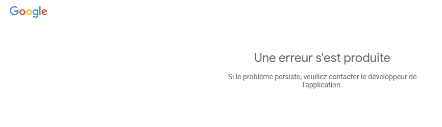
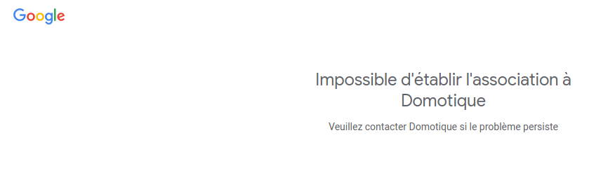

# Troubleshooting

You can force a restart of the quickApp by restarting the Fibaro Home Center or by modifying/saving the quickApp's parameters

### Authentication - projectId problem

In the console log, you have this kind of log (you have to wait 2*frequency because each authentication step is made one loop).

```bash
[23.01.2023] [14:06:26] [ERROR] [QUICKAPP245]: getAccessToken() status is 400: { "error
[23.01.2023] [14:07:26] [DEBUG] [QUICKAPP245]: Get Google refresh token
[23.01.2023] [14:07:26] [ERROR] [QUICKAPP245]: getRefreshToken() status is 400: { "error
[23.01.2023] [14:08:26] [ERROR] [QUICKAPP245]: Need to refresh Nest Authentication code for quickApp 245 with https://nestservices.google.com/partnerconnections/xxx/auth?redirect_uri=https://www.google.com&access_type=offline&prompt=consent&client_id=xxx.apps.googleusercontent.com&response_type=code&scope=https://www.googleapis.com/auth/sdm.service
```

When you open the URL, after logging into your Google account, if you got this kind of error, you have made errors in **_"Project ID"_**. Check if [all installation steps](#detailled-installation-guide) are correct.




### Authentication - clientId problem

```bash
[23.01.2023] [14:06:26] [ERROR] [QUICKAPP245]: getAccessToken() status is 401: { "error
[23.01.2023] [14:07:26] [DEBUG] [QUICKAPP245]: Get Google refresh token
[23.01.2023] [14:07:26] [ERROR] [QUICKAPP245]: getRefreshToken() status is 401: { "error
[23.01.2023] [14:08:26] [ERROR] [QUICKAPP245]: Need to refresh Nest Authentication code for quickApp 245 with https://nestservices.google.com/partnerconnections/xxx/auth?redirect_uri=https://www.google.com&access_type=offline&prompt=consent&client_id=xxx.apps.googleusercontent.com&response_type=code&scope=https://www.googleapis.com/auth/sdm.service
```

If you got this kind of error, your projectId is correct and you have made errors in **_"OAuth 2.0 Client ID"_**. Check if [all installation steps](#detailled-installation-guide) are correct.





### Authentication - clientSecret problem

When your projectId and clientId is correct you have a page like this:


At the end of the process, you have the [Authentication code](#get-the-authentication-code).
After setting the code in the quickApp's parameter, if you get an error log like this, you made have a problem in **_"Client Secret"_** or **_"Authentication code"_**.

```bash
[23.01.2023] [14:06:26] [ERROR] [QUICKAPP245]: getAccessToken() status is 401: { "error
[23.01.2023] [14:07:26] [DEBUG] [QUICKAPP245]: Get Google refresh token
[23.01.2023] [14:07:26] [ERROR] [QUICKAPP245]: getRefreshToken() status is 401: { "error
[23.01.2023] [14:08:26] [ERROR] [QUICKAPP245]: Need to refresh Nest Authentication code for quickApp 245 with https://nestservices.google.com/partnerconnections/xxx/auth?redirect_uri=https://www.google.com&access_type=offline&prompt=consent&client_id=xxx.apps.googleusercontent.com&response_type=code&scope=https://www.googleapis.com/auth/sdm.service
```


### Authentication - no problem

If you get this log, the authentication steps are ok.

```bash
[23.01.2023] [15:35:13] [DEBUG] [QUICKAPP245]: QuickApp:onInit
[23.01.2023] [15:35:13] [TRACE] [QUICKAPP245]: NestThermostatTemperature init
[23.01.2023] [15:35:13] [TRACE] [QUICKAPP245]: NestThermostatHumidity init
[23.01.2023] [15:35:13] [TRACE] [QUICKAPP245]: NestThermostat init
[23.01.2023] [15:35:13] [TRACE] [QUICKAPP245]: Child devices:
[23.01.2023] [15:35:13] [TRACE] [QUICKAPP245]: [248] Nest Humidity of type com.fibaro.humiditySensor with UID enterprises/xxxHumidity
[23.01.2023] [15:35:13] [TRACE] [QUICKAPP245]: [405] Thermostat of type com.fibaro.hvacSystemAuto with UID enterprises/xxx
[23.01.2023] [15:35:13] [TRACE] [QUICKAPP245]: [247] Nest Temp of type com.fibaro.temperatureSensor with UID enterprises/xxxTemperature
[23.01.2023] [15:35:13] [ERROR] [QUICKAPP245]: getAccessToken() status is 400: { "error
[23.01.2023] [15:36:13] [DEBUG] [QUICKAPP245]: Get Google refresh token
[23.01.2023] [15:36:14] [DEBUG] [QUICKAPP245]: getRefreshToken() succeed
[23.01.2023] [15:36:14] [TRACE] [QUICKAPP245]: Bearer xxxxxxxxxxxxxxx
```

Three quickApp childs must be created (hvacSystem, Temperature and Humidity).


### Network error - Google Nest API

You can check the performance of API call with [https://console.cloud.google.com/apis](https://console.cloud.google.com/apis).

The API name is *Smart Device Management API*

If you have some traffic, your connection is ok.
The number of call/s depends of the frequency (default to one call per minute = 0.016/s).
If you have less traffic, the problem come from your internet connection that failed to contact the Google API.


If you have some errors, the problem come from the Google API.


### Network error - Timeout

If you have this error, the Google API tooks to long to respond.
Consequently, the fibaro widget are not updated and you will have to wait the next loop (configured with frequency).

This problem come from your internet connection or from the Google API.

```bash
[21.01.2023] [03:00:19] [ERROR] [QUICKAPP245]: listNestDevice() failed: "Operation canceled"
```

### Google Nest API Error

If you have this error, the Google API crash.
Consequently, the fibaro widget are not updated and you will have to wait the next loop (configured with frequency).

```bash
[21.01.2023] [03:01:16] [ERROR] [QUICKAPP245]: listNestDevice() status is 500: { "error
```
