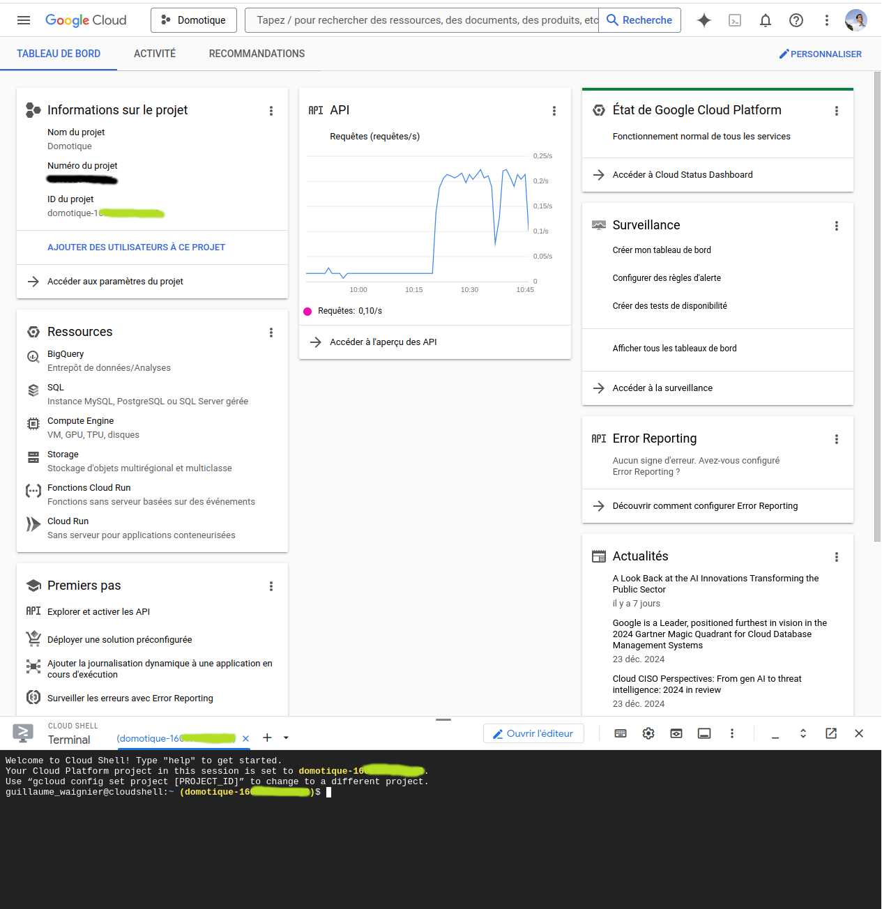

# Installation for detecting motion from Camera and doorbell

## Requirement

Follow the doc [https://developers.google.com/nest/device-access/subscribe-to-events](https://developers.google.com/nest/device-access/subscribe-to-events)


## Detailled Installation Guide

All steps are explained in the doc : [https://developers.google.com/nest/device-access/subscribe-to-events](https://developers.google.com/nest/device-access/subscribe-to-events)

These steps are:
1. Open the [console web page](https://console.nest.google.com/device-access?)
2. Enable the Google Pub/Sub
    - You get the **Sujet Pub/Sub** of the form "*projects/sdm-prod/topics/enterprise-xxxxxxxx-xxxx-xxxx-xxxx-xxxxxxxxxxxx*"
3. Open the [Google Cloud Shell](https://console.cloud.google.com/home/dashboard?cloudshell=true)
4. Create the subscriptions by writting this command in the terminal below the web page (replace *projects/sdm-prod/topics/enterprise-xxxxxxxx-xxxx-xxxx-xxxx-xxxxxxxxxxxx* by your **Sujet Pub/Sub** retrieve at step 2)
```bash
gcloud pubsub subscriptions create fibaro --topic=projects/sdm-prod/topics/enterprise-xxxxxxxx-xxxx-xxxx-xxxx-xxxxxxxxxxxx
```
5. The name *fibaro* is the **_subscription_** needed in config in [fibaro variables](../README.md#variables)

6. You need to see your subcription at this [web page](https://console.cloud.google.com/cloudpubsub/subscription)


## Retrieve the GCP Project Id

On this [Page](https://console.cloud.google.com/home/dashboard?cloudshell=true), you can get the **_gcpProjectId_**.
It is on the form of *domotique-1201240210101*.
It is written in several location on the page :
* in yellow in the console below the screen.
* in the widget 'Project information' under 'project id'
* in blue above the Terminal


# Troubleshooting

If you encounter issues with the quickApp, you can try restarting it by either restarting the Fibaro Home Center or modifying and saving the quickApp's parameters.

## Configuration Issues: gcpProjectId or Subscription Problem

If you see an error like the one below in your logs:


```bash
[06.01.2025] [10:37:25] [ERROR] [QUICKAPP245]: getPubSubEvent() status is 404: { "error
```

This 404 error indicates a misconfiguration in the Fibaro variables.

First, verify that the **_gcpProjectId_** is correctly configured.
You can confirm this on the [Google Cloud Console](https://console.cloud.google.com/home/dashboard?cloudshell=true).
The gcpProjectId should appear in green, as shown in the screenshot below.





Then, verify the **_subscription_** is correct.


## Authentication Issues - Wrong Authentication Code

If you see an error like the one below in your logs:


```bash
[06.01.2025] [10:37:25] [ERROR] [QUICKAPP245]: getPubSubEvent() status is 403: { "error
```

A 403 error indicates an authentication issue, specifically that access to Pub/Sub is forbidden.

This issue typically occurs when the Authentication URL was not fully copied during [this step](../README.md#get-the-authentication-code). It's important to ensure the entire URL is copied correctly.

When activating Pub/Sub, the URL should contains 2 scopes (rights).
The URL will look something like this:


https://www.google.com/?code=4/xxxxx-xxxxxxxxxxxxxxxxxxxxxxxxxxxxxxxxxxxxx&scope=https://www.googleapis.com/auth/sdm.service%20https://www.googleapis.com/auth/pubsub

* The scope https://www.googleapis.com/auth/sdm.service is used to list Nest devices and to connect to the Nest thermosthat
* The scope https://www.googleapis.com/auth/pubsub is used to connect to the pubsub (Nest Camera and doorbell)

Sometimes, when clicking on the URL sent in the email, only the first scope is passed to your web browser. This can cause the authentication to fail.

To restart the authentication process, replace the value of the **_refreshToken_** in the Fibaro variable with a single dash (-).
This action will trigger the system to resend the authentication email.
When cliking on link in the email, check the end of the URL to ensure that both scopes are included. If the second scope is missing, manually add it to the URL before proceeding.
