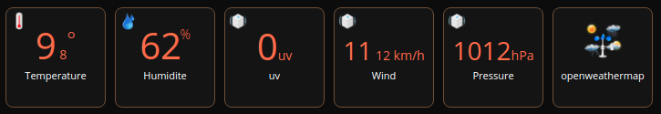

# QuickApp for OpenWeatherMap

Device type: *device controller*

## Required

Create an API key in [https://openweathermap.org/appid](https://openweathermap.org/appid)

## Variables

| Name          | Description   | Example of value |
| ------------- | ------------- |------------------|
| locationId    | locationId of the fibaro HC3 in API GET /panels/location   | 219 |
| APIKey  | API key in [https://openweathermap.org/appid](https://openweathermap.org/appid)  | |
| unit  | unit for metric (see [https://openweathermap.org/current#data](https://openweathermap.org/current#data))  | metric|
| frequency  | delay in second to refresh the value  | 600 |

Note:

Wind is converted in km/h (hardcoded)
