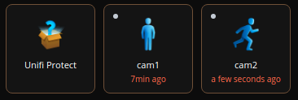

# QuickApp for UnifiProtect

Device type: *device controller*

## Required

Unifi Protect controller is required.
Create a new readOnly user.

## Variables

| Name          | Description   | Example of value |
| ------------- | ------------- |------------------|
| controller    | URL of the unifi protect controller   | https://127.0.0.1:7443 |
| login  | user login  | fibaro |
| password  | user password  | |
| frequency  | delay in second to refresh the value  | 60 |
| away delay  | duration in second when the sensor is breached  | 120 |

## Features

Create a motion sensor for each Unifi Camera.
The motion sensor is triggered depending of the las motion detection in Unifi Protect Controller.

