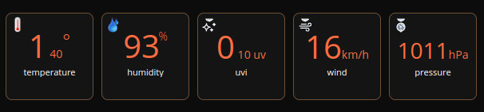

# QuickApp for weatherapi

Device type: *device controller*

## Required

Create an API key in [https://weatherapi.com](https://weatherapi.com)

## Variables

| Name          | Description   | Example of value |
| ------------- | ------------- |------------------|
| locationId    | locationId of the fibaro HC3 in API GET /panels/location   | 219 |
| APIKey  | API key in [https://weatherapi.com](https://weatherapi.com)  | |
| frequency  | delay in second to refresh the value  | 600 |

